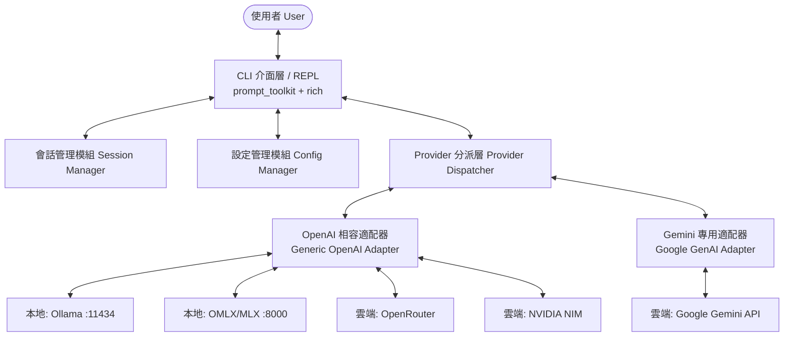

# CLI Chat 工具規格書與實作計劃

## 1. 可行性評估 (Feasibility Analysis)

自行開發支援多後端（本地端與雲端）的 CLI Chat 工具**可行性極高且開發難度適中**。

### 1.1 各模型後端協議相容性分析

| 後端名稱 | 類型 | 協定與介面相容性 | 實作策略 |
| :--- | :--- | :--- | :--- |
| **Ollama** | 本地 | 原生支援 `/v1/chat/completions` (OpenAI 格式) 與原生 `/api/chat` | 優先使用 OpenAI 相容介面，亦可直接使用 REST API |
| **OMLX / MLX** | 本地 (Apple Silicon) | 提供相容 OpenAI 的 API server (例如 `omlx serve` 或 `mlx_lm.server`) | 當作標準 OpenAI-compatible endpoint 處理 |
| **OpenRouter** | 雲端 | 100% 相容 OpenAI 規格 (`https://openrouter.ai/api/v1`) | 標準 OpenAI 規格，僅需自訂 Base URL 與 API Key |
| **NVIDIA NIM** | 雲端/邊緣 | 100% 相容 OpenAI 規格 (`https://integrate.api.nvidia.com/v1`) | 標準 OpenAI 規格，傳入 NVIDIA API Key 即可 |
| **Google Gemini** | 雲端 | 專屬 REST/gRPC API，亦提供 Google AI Studio OpenAI-compatible endpoint | 方案 A：使用官方 SDK (`google-genai`)；方案 B：使用 Gemini OpenAI 相容端點 |

> **核心發現**：
> 5 個目標後端中，有 4 個原生即相容 **OpenAI Chat Completion 協定**，Gemini 也具備官方相容端點或成熟 SDK。這代表底層只需要實作一套「**統一的 Provider 抽象介面 (OpenAI 協定為主 + Gemini 擴展適配器)**」，即可支援所有目標模型，維護成本低。

### 1.2 語言與技術棧選型評估

| 語言 | 優勢 | 劣勢 | 評估結論 |
| :--- | :--- | :--- | :--- |
| **Python** | 生態最豐富 (豐富的 LLM 與 Terminal UI 函式庫：`rich`, `prompt_toolkit`, `textual`, `openai`)；與 Apple MLX/Ollama 本地環境整合自然。 | 執行啟動速度略慢（約 100-200ms），單執行檔打包體積較大。 | **最推薦 (MVP 與功能擴充最快首選)** |
| **Go** | 編譯成單一獨立二進位檔 (Single Binary)，無環境依賴；終端介面生態成熟 (`bubbletea`, `lipgloss`)。 | 缺少部分 Python 生態的現成 AI 套件，需手寫串接邏輯。 | **若極度重視效能與無依賴發布時的最佳首選** |
| **Rust** | 效能頂級、記憶體安全，有強大的 `ratatui` 終端框架。 | 開發成本最高、生命週期與型別處理時間較長。 | 適合後期重構或追求極致極簡時考慮 |
| **Node/TS** | 終端有 `ink` (React CLI) 等優秀套件，串接 API 快速。 | 需要 Node.js/Bun 執行時環境，終端色彩與 raw mode 偶有跨平台細節。 | 次選 |

---

## 2. 系統架構與規格 (System Architecture & Specification)



### 2.1 核心功能規格

1. **互動式 REPL 聊天模式**：
   - 即時字元串流（Streaming）漸進式顯示回應。
   - Markdown 即時語法高亮、程式碼區塊著色。
   - 輸入歷史記錄（Up/Down 歷史查找、自動補全）。
2. **多 Provider 動態切換**：
   - 支援 Slash Commands：在同一會話中隨時切換模型，例如 `/model gemini-2.5-flash`、`/model ollama/llama3.3`。
   - 預設提供者與後備（Fallback）機制。
3. **對話管理與歷史儲存**：
   - 支援對話歷程自動儲存（JSONL / SQLite）。
   - 指令：`/clear` 清空對話、`/save <filename>` 匯出 Markdown/JSON、`/history` 查看過往會話。
4. **單次問答與管線模式 (Pipeline mode)**：
   - 支援管道輸入：`cat file.txt | cyc "請總結這段內容"`。
   - 支援非互動式即時輸出，方便與 Shell Script 整合。

### 2.2 設定檔規範 (`~/.config/cyc/config.yaml`)

```yaml
# 預設使用的提供者與模型
default_provider: ollama
default_model: llama3.3:latest

# 提供者詳細設定
providers:
  ollama:
    type: openai_compatible
    base_url: "http://localhost:11434/v1"
    api_key: "ollama" # 本地免 key，但 client library 需要佔位符
    default_model: "llama3.3:latest"

  omlx:
    type: openai_compatible
    base_url: "http://localhost:8000/v1"
    api_key: "empty"
    default_model: "default"

  openrouter:
    type: openai_compatible
    base_url: "https://openrouter.ai/api/v1"
    api_key: "${OPENROUTER_API_KEY}"
    default_model: "anthropic/claude-3.5-sonnet"

  nvidia:
    type: openai_compatible
    base_url: "https://integrate.api.nvidia.com/v1"
    api_key: "${NVIDIA_API_KEY}"
    default_model: "meta/llama-3.3-70b-instruct"

  gemini:
    type: gemini_native # 或 openai_compatible
    api_key: "${GEMINI_API_KEY}"
    default_model: "gemini-2.5-flash"

# 介面設定
ui:
  theme: "monokai"
  stream: true
  markdown_render: true
```

---

## 3. 模組設計 (Module Design)

```
cyc/
├── config.py         # 讀取 ~/.config/cyc/config.yaml 與環境變數
├── providers/        # 提供者介面與實作
│   ├── base.py       # BaseProvider 抽像類別 (定義 chat_stream, list_models)
│   ├── openai.py     # 涵蓋 Ollama, OMLX, OpenRouter, NVIDIA 的通用 OpenAI 適配器
│   └── gemini.py     # Google Gemini 適配器
├── session.py        # 對話歷史與上下文維護
├── cli.py            # 入口點，支援 argparse / click
└── ui.py             # 終端渲染 (Rich Console, Markdown, prompt_toolkit 互動)
```

### 3.1 核心抽象介面 (`BaseProvider`)

```python
from abc import ABC, abstractmethod
from typing import AsyncGenerator, Dict, List

class BaseProvider(ABC):
    @abstractmethod
    async def chat_stream(
        self, 
        messages: List[Dict[str, str]], 
        model: str,
        **kwargs
    ) -> AsyncGenerator[str, None]:
        """串流回傳文字 chunk"""
        pass

    @abstractmethod
    async def list_models(self) -> List[str]:
        """列出當前 Provider 可用的模型清單"""
        pass
```

---

## 4. 實作計劃與進度排程 (Implementation Plan)

### Phase 1: MVP 核心原型 (預估 1-2 天) [已完成]
- [x] 專案骨架建置 (使用 `pyproject.toml` 或 `poetry`)
- [x] 實作設定檔載入機制（支援讀取 YAML 與環境變數替換）
- [x] 實作 `BaseProvider` 與 `OpenAICompatibleProvider`
- [x] 驗證連接本地 Ollama 與雲端 OpenRouter
- [x] 基礎 CLI 迴圈，完成串流輸出測試

### Phase 2: 全 Provider 串接與會話機制 (預估 2-3 天) [已完成]
- [x] 接入 OMLX (針對本地 Apple Silicon MLX 伺服器驗證)
- [x] 接入 NVIDIA NIM 端點
- [x] 實作 Gemini 適配器 (使用官方 SDK 或 OpenAI 規格)
- [x] 實作 `SessionManager`：記錄多輪對話 Context、Token 估算與超長裁剪策略

### Phase 3: 互動體驗與指令增強 (預估 2 天) [已完成]
- [x] 終端 UI 升級：使用 `prompt_toolkit` 支援多行輸入、按鍵快捷鍵 (Ctrl+C, Ctrl+D)
- [x] 整合 `rich` 進行即時 Markdown 串流渲染
- [x] 實作 Slash Commands：
  - `/model [name]` 切換模型 (支援 Tab 自動補全)
  - `/models` 查詢當前 Provider 模型清單並表格化顯示
  - `/provider [name]` 動態切換提供者 (支援 Tab 自動補全)
  - `/clear` 清空對話
  - `/system [prompt]` 設定或檢視系統提示詞
  - `/tokens` 顯示 Context Token 統計與占用率表格
  - `/multiline` 切換多行/單行輸入模式
  - `/save [filepath]` 匯出當前對話 (支援 Markdown 與 JSON)
  - `/load [filepath]` 載入歷史對話繼續聊
- [x] 實作管線模式（支援非互動式 stdin 讀取）

### Phase 4: 打包與發布 (預估 1 天) [已完成]
- [x] 提供全域 CLI 命令安裝 (`pip install -e .`、`uv tool install .` 或 `pipx`)
- [x] 提供預設設定檔生成精靈 (`cyc init` / `cyc --init [-f]`)
- [x] 撰寫單元測試與 Mock 串流測試 (涵蓋 OpenAI Compatible 與 Gemini Provider，共 19 項測試通過)
- [x] 完成 Wheel 與 Source Distribution 建置驗證 (`uv build`)

---

## 5. 驗證與測試策略 (Verification & Testing)

1. **本地端整合驗證**：
   - 啟動本地 `ollama serve`，執行 `cyc --provider ollama` 驗證本地推論。
   - 啟動 `omlx` 伺服器，驗證 OMLX endpoint 回應正確性。
2. **雲端端點串接驗證**：
   - 設定 `GEMINI_API_KEY`, `OPENROUTER_API_KEY`, `NVIDIA_API_KEY`，輪流切換各模型測試問答。
3. **邊界情況測試**：
   - 網路中斷/端點無回應時的逾時處理與友善錯誤訊息。
   - 串流中途使用 `Ctrl+C` 中斷當前輸出，確保不崩潰並可繼續下一次輸入。
   - 大文本 (超過 context window) 的截斷或警告處理。
